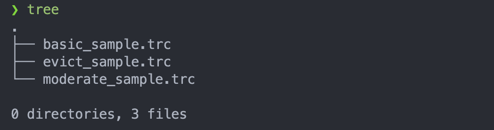

# cache-simulator

Computer Architecture - Final Cache-Simulator Assignment


This is a computer-architecture assignment implements a set associative cache simulator written in <code>C, Shell Script</code>. A set associative cache simulator Write policy is write-back and it follows LRU replacement strategy

### How to execute <code>test.sh</code>

---

1. check help manual

```
    $ ./{relative_path}/test.sh -h
    or
    $ (bash | sh) ${relative_path}/test.sh -h
    USAGE:
    test.sh [-s=<val>] [-b=<val>] [-a=<val>] [-d=<val>]
        [-h]

    DESCRIPTIONS:
    -s=<val>, s( cache_size ): total size of cache
    -b=<val>, b( block_size ): size of block
    -a=<val>, a( associative_size ): cache assocative size
    -d=<val>, d( dir_name ): tracefile set directory name
    -h, print usage
```

2. Simulate the tracefile

```
    $ ./{relative_path}/test.sh -s {cache_size} -b {block_size} -a {associative_size} -d {tracefile_directory}
```

- tracefile_direcyory
  
  it must include varity type of trace file to simulate
